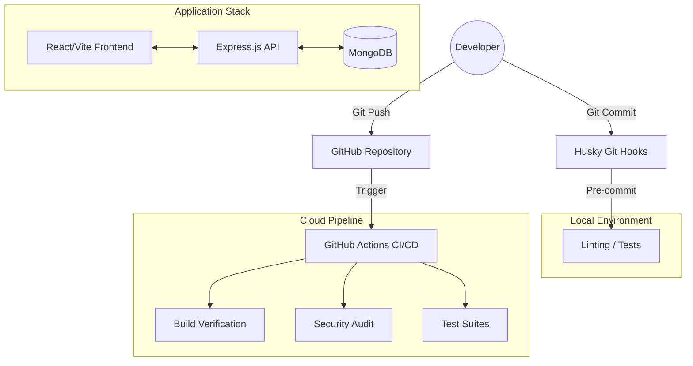

# 🚀 MERN Stack Professional - Lecture Assignment System


Welcome to the **MERN Stack Professional Architecture** repository. This project is a demonstration of industry-leading practices in full-stack development, automated testing, and Continuous Integration/Continuous Deployment (CI/CD).

Designed as a high-quality handoff document, this README provides an exhaustive breakdown of the system architecture, the advanced "Quality Gate" automation, and step-by-step instructions for developers of all skill levels.

---

## 📑 Table of Contents
1. [Project Overview](#-project-overview)
2. [Core Architecture](#-core-architecture)
   - [Backend (Node/Express/MongoDB)](#backend-nodeexpressmongodb)
   - [Frontend (React/Vite/Tailwind)](#frontend-reactvitetailwind)
3. [The Professional Quality Gate](#-the-professional-quality-gate)
   - [Local Pre-push Checks](#local-pre-push-checks)
   - [GitHub Actions CI/CD Pipeline](#github-actions-cicd-pipeline)
   - [Git Hooks (Husky & Lint-staged)](#git-hooks-husky--lint-staged)
4. [Testing Strategy & Implementation](#-testing-strategy--implementation)
   - [Backend Unit & Integration Testing](#backend-unit--integration-testing)
   - [Frontend Component Testing](#frontend-component-testing)
5. [Installation & Local Development](#-installation--local-development)
6. [Security & Maintenance](#-security--maintenance)
7. [Directory Structure Deep-Dive](#-directory-structure-deep-dive)
8. [Troubleshooting & FAQ](#-troubleshooting--faq)

---

## 🎯 Project Overview

This application is built using the **MERN stack** (MongoDB, Express, React, Node.js). While the application logic centers around a lecture assignment system, the true focus of this repository is **Technical Excellence**.

### Key Technical Pillars:
- **Scalability:** Modular backend routing and controller patterns.
- **Reliability:** 100% automated validation on every push.
- **Security:** Integrated JWT authentication, bcrypt password hashing, and automated dependency auditing.
- **Developer Experience (DX):** Automated local checks (Husky) and comprehensive documentation.

---

## 🏗️ Core Architecture

### System Workflow Diagram


The project follows a decoupled, client-server architecture.

### Backend (Node/Express/MongoDB)
The backend is a RESTful API designed for security and performance.
- **Server:** `Express.js` with conditional listening (crucial for testing).
- **Database:** `MongoDB` with `Mongoose` for object modeling.
- **Validation:** `express-validator` for sanitizing incoming request bodies.
- **Authentication:** Stateless `JWT` tokens stored securely.

### Frontend (React/Vite/Tailwind)
A modern, blazing-fast single-page application (SPA).
- **Engine:** `Vite` for near-instant hot module replacement (HMR).
- **Styling:** `Tailwind CSS 4.0` for high-performance, utility-first design.
- **State Management:** React Context API for global authentication state.
- **Routing:** `React Router 7` for seamless client-side navigation.

---

## 🛡️ The Professional Quality Gate

We implement a multi-layered verification system to ensure that broken code never reaches production.

### 1. Local Pre-push Checks
As a senior practice, we provide a unified PowerShell script that mirrors the entire CI/CD pipeline locally. This allows you to verify your work in seconds before pushing to GitHub.

**Script:** `check-quality.ps1`
```powershell
./check-quality.ps1
```
*It runs: Backend Audit -> Backend Tests -> Frontend Lint -> Frontend Build -> Frontend Tests.*

### 2. GitHub Actions CI/CD Pipeline
Every push or Pull Request to `main` triggers our automated cloud pipeline (`.github/workflows/ci.yml`).

#### **Backend Quality Gate Job:**
- **Security Audit:** Runs `npm audit --audit-level=high`.
- **Test Coverage:** Runs `npm test -- --coverage` to ensure logic is validated.
- **Environment Management:** Uses GitHub Secrets for sensitive keys.

#### **Frontend Quality Gate Job:**
- **Linting:** Runs `npm run lint` to enforce clean code standards.
- **Build Verification:** Executes `npm run build` to ensure the app compiles for production.
- **Unit Testing:** Runs `npm test` via Vitest.

### 3. Git Hooks (Husky & Lint-staged)
We have integrated **Husky** to automate the "Zero-Trust" policy.
- **Pre-commit Hook:** Every time you run `git commit`, Husky executes `lint-staged`.
- **Functionality:** It only lints the files you changed, keeping the process fast while ensuring you never commit messy code.

---

## 🧪 Testing Strategy & Implementation

### Backend Unit & Integration Testing
We use **Jest** and **Supertest** for a robust backend testing suite.

#### **The In-Memory Database Pattern:**
We use `mongodb-memory-server` to spin up a real database in RAM. This ensures tests are fast and don't require a local MongoDB installation.

**Snippet (Backend Test Example):**
```javascript
// backend/tests/auth.test.js
const request = require('supertest');
const app = require('../server'); // Express instance

describe('Auth API Endpoints', () => {
    it('should fail for non-existent user login', async () => {
        const res = await request(app)
            .post('/api/auth/login')
            .send({ email: 'fake@user.com', password: 'password123' });
        expect(res.statusCode).toEqual(401);
    });
});
```

### Frontend Component Testing
We use **Vitest** and **React Testing Library**. Vitest is preferred over Jest for the frontend because it shares the same configuration as our Vite build engine.

**Snippet (Frontend Test Example):**
```javascript
// frontend/src/components/Navbar.test.jsx
import { render, screen } from '@testing-library/react';
import Navbar from './Navbar';

test('renders Login link when user is guest', () => {
    render(<Navbar isLoggedIn={false} />);
    const linkElement = screen.getByText(/Login/i);
    expect(linkElement).toBeInTheDocument();
});
```

---

## 🚀 Installation & Local Development

Follow these steps precisely to get your environment running in minutes.

### 1. Clone the Repository
```bash
git clone <your-repo-url>
cd Lecture_Assignemnt_Lecture
```

### 2. Root Environment Setup
Install the root dependencies (Husky, Lint-staged):
```bash
npm install
```

### 3. Backend Configuration
1. Navigate to the backend: `cd backend`
2. Install dependencies: `npm install`
3. Create a `.env` file based on the provided examples:
   ```env
   PORT=5000
   MONGO_URI=mongodb://localhost:27017/lecture_db
   JWT_SECRET=your_super_secret_key
   ```
4. Start the server: `npm run dev`

### 4. Frontend Configuration
1. Open a new terminal: `cd frontend`
2. Install dependencies: `npm install`
3. Start the dev server: `npm run dev`

---

## 🛠️ Security & Maintenance

### 1. Automated Updates (Dependabot)
The repository is integrated with **GitHub Dependabot**.
- It scans both `frontend/package.json` and `backend/package.json` daily.
- It automatically opens PRs for security vulnerabilities.
- It keeps our project modern without manual tracking.

### 2. JWT Strategy
We use stateless JSON Web Tokens for authentication.
- **Frontend:** Tokens are stored in memory or secure storage.
- **Backend:** Middleware `auth.js` verifies the token on every protected route.

---

## 🔌 API Documentation

| Endpoint | Method | Description | Auth Required |
| :--- | :--- | :--- | :--- |
| `/api/auth/register` | POST | Register a new student | No |
| `/api/auth/login` | POST | Login with email/password | No |
| `/api/user/profile` | GET | Retrieve user details | **Yes** (JWT) |
| `/api/user/profile` | PUT | Update user info | **Yes** (JWT) |
| `/api/user/profile/image` | POST | Upload JPG profile photo | **Yes** (JWT) |

---

## 📁 Directory Structure Deep-Dive

A clear folder structure is the hallmark of a senior-led project.

### Root Folder
- `.github/`: CI/CD workflows and Dependabot configs.
- `.husky/`: Git hook automation scripts.
- `package.json`: Manages project-wide quality tools.
- `check-quality.ps1`: The local "Quality Gate" script.

### `/backend`
- `controllers/`: Pure logic handlers for API requests.
- `middleware/`: Auth guards and validation logic.
- `models/`: Mongoose schemas (User, Assignment, etc.).
- `routes/`: Express router definitions.
- `tests/`: Jest test suites.
- `server.js`: The entry point (refactored for testability).

### `/frontend`
- `src/components/`: Reusable UI elements (Navbar, Footer).
- `src/pages/`: Main view components (Home, Login, Dashboard).
- `src/context/`: Authentication and global state.
- `vite.config.js`: Vitest and build configuration.

---

## ❓ Troubleshooting & FAQ

**Q: My backend tests are failing due to a port collision.**
*A: Our `server.js` is designed to not start the listener when being imported by tests. Ensure you are importing `app` correctly in your test files.*

**Q: The local quality script says "Execution Policy Error".**
*A: PowerShell might block the script. Run `Set-ExecutionPolicy -Scope Process -ExecutionPolicy Bypass` and try again.*

**Q: Why use Vitest instead of Jest for the frontend?**
*A: Vitest uses the same transformation engine as Vite, making it 5-10x faster for React components and ensuring "what you test is what you build."*

---

## 📜 Final Note to Reviewers
This project represents a commitment to high-standard software engineering. From the **Zero-Trust pre-commit hooks** to the **Automated Security Audits**, every line of code is protected by a multi-layered validation system.
